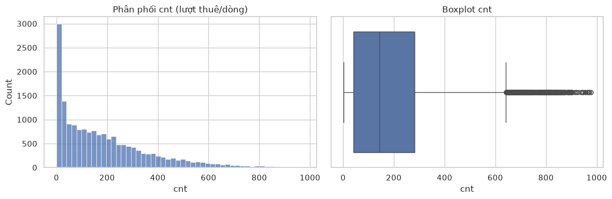
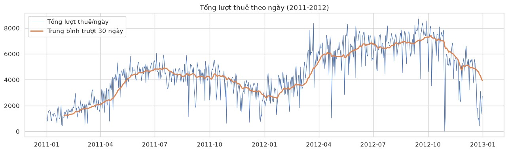
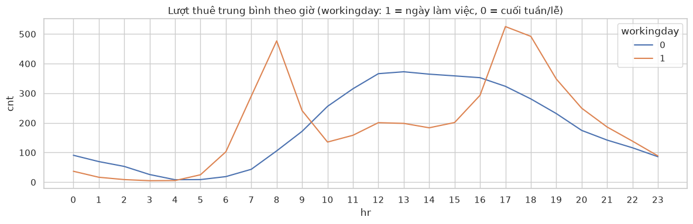
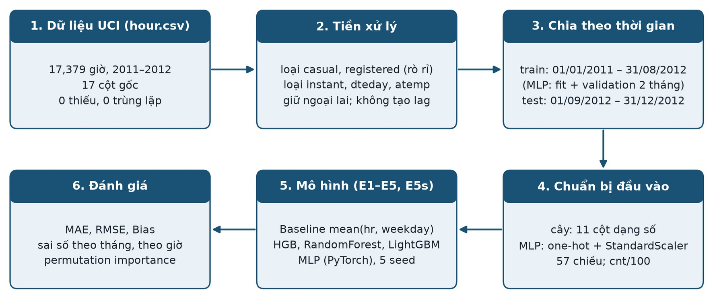
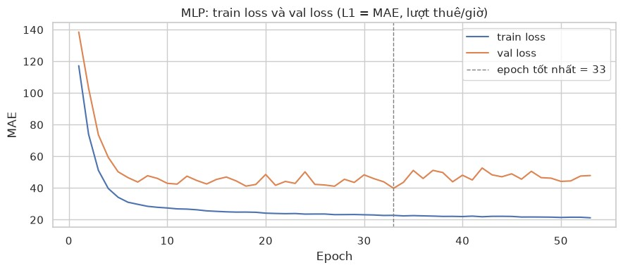
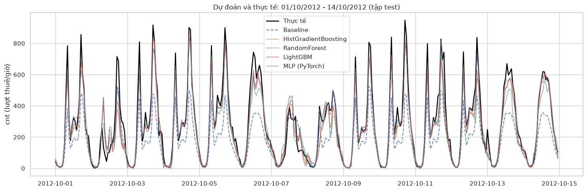
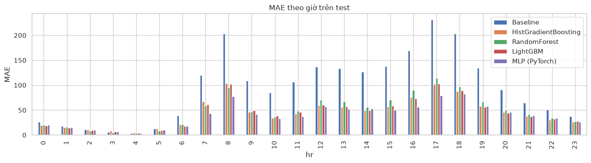

<div align="center">

**ĐẠI HỌC QUỐC GIA TP. HỒ CHÍ MINH**<br>
**TRƯỜNG ĐẠI HỌC CÔNG NGHỆ THÔNG TIN**<br>
KHOA HỆ THỐNG THÔNG TIN


**BÁO CÁO ĐỒ ÁN CUỐI KỲ - Draft**<br>
**Môn học: HỌC SÂU VÀ ỨNG DỤNG TRONG KINH DOANH**

# DỰ BÁO NHU CẦU THUÊ XE ĐẠP CÔNG CỘNG THEO GIỜ BẰNG MẠNG NƠ-RON MLP

**So sánh với các mô hình học máy dạng cây**

</div>

| **Lớp:** | IS6109.11.CH |
|---|---|
| **Giảng viên:** | TS. Tạ Hoàng Thắng |
| **Nhóm thực hiện:** | Nguyễn Lý Trường Sơn <br>Tạ Nhật Hưng <br>Nguyễn Vũ Mai Phương <br>Đoàn Phạm Thanh Luân  |
| **Ngày nộp:** | [date] |

<div align="center">

**TP. HỒ CHÍ MINH — THÁNG 10 NĂM 2026**

</div>

> Nội dung README này được chuyển đầy đủ từ báo cáo PDF gốc: [docs/bao-cao-du-bao-thue-xe-dap.pdf](docs/bao-cao-du-bao-thue-xe-dap.pdf). Notebook thực nghiệm: [notebooks/bike_sharing_regression.ipynb](notebooks/bike_sharing_regression.ipynb). Xem thêm mục [Cấu trúc repo & cách chạy](#cấu-trúc-repo--cách-chạy) ở cuối trang.

---

## MỤC LỤC

- [1. TÊN ĐỀ TÀI](#1-tên-đề-tài)
- [2. TÓM TẮT](#2-tóm-tắt)
- [3. GIỚI THIỆU](#3-giới-thiệu)
  - [3.1. Bối cảnh](#31-bối-cảnh)
  - [3.2. Tầm quan trọng của bài toán](#32-tầm-quan-trọng-của-bài-toán)
  - [3.3. Vai trò của AI và học sâu](#33-vai-trò-của-ai-và-học-sâu)
  - [3.4. Động lực](#34-động-lực)
  - [3.5. Mục tiêu](#35-mục-tiêu)
  - [3.6. Câu hỏi nghiên cứu](#36-câu-hỏi-nghiên-cứu)
- [4. TỔNG QUAN NGHIÊN CỨU](#4-tổng-quan-nghiên-cứu)
  - [4.1. Phương pháp học máy truyền thống](#41-phương-pháp-học-máy-truyền-thống)
  - [4.2. Phương pháp học sâu](#42-phương-pháp-học-sâu)
  - [4.3. Bộ dữ liệu và độ đo phổ biến](#43-bộ-dữ-liệu-và-độ-đo-phổ-biến)
  - [4.4. Khoảng trống nghiên cứu và định vị đề tài](#44-khoảng-trống-nghiên-cứu-và-định-vị-đề-tài)
- [5. ĐỊNH NGHĨA BÀI TOÁN](#5-định-nghĩa-bài-toán)
- [6. DỮ LIỆU](#6-dữ-liệu)
  - [6.1. Thông tin chung](#61-thông-tin-chung)
  - [6.2. Đặc trưng và kiểu dữ liệu](#62-đặc-trưng-và-kiểu-dữ-liệu)
  - [6.3. Phân bố biến mục tiêu](#63-phân-bố-biến-mục-tiêu)
  - [6.4. Chia dữ liệu theo thời gian](#64-chia-dữ-liệu-theo-thời-gian)
  - [6.5. Tiền xử lý](#65-tiền-xử-lý)
  - [6.6. Chuẩn hóa và chuẩn bị dữ liệu cho MLP](#66-chuẩn-hóa-và-chuẩn-bị-dữ-liệu-cho-mlp)
- [7. PHƯƠNG PHÁP VÀ THIẾT KẾ THỰC NGHIỆM](#7-phương-pháp-và-thiết-kế-thực-nghiệm)
  - [7.1. Lựa chọn phương pháp](#71-lựa-chọn-phương-pháp)
  - [7.2. Quy trình tổng thể và huấn luyện MLP](#72-quy-trình-tổng-thể-và-huấn-luyện-mlp)
  - [7.3. Thiết kế thực nghiệm](#73-thiết-kế-thực-nghiệm)
  - [7.4. Độ đo đánh giá](#74-độ-đo-đánh-giá)
  - [7.5. Phân tích sai số và diễn giải](#75-phân-tích-sai-số-và-diễn-giải)
- [8. KẾT QUẢ THỰC NGHIỆM](#8-kết-quả-thực-nghiệm)
  - [8.1. So sánh các mô hình](#81-so-sánh-các-mô-hình)
  - [8.2. Độ ổn định của MLP theo seed](#82-độ-ổn-định-của-mlp-theo-seed)
  - [8.3. Khả năng ngoại suy xu hướng](#83-khả-năng-ngoại-suy-xu-hướng)
  - [8.4. Sai số theo thời điểm](#84-sai-số-theo-thời-điểm)
  - [8.5. Mức độ quan trọng của đặc trưng](#85-mức-độ-quan-trọng-của-đặc-trưng)
  - [8.6. Tổng hợp theo câu hỏi nghiên cứu](#86-tổng-hợp-theo-câu-hỏi-nghiên-cứu)
- [9. THẢO LUẬN, ĐÓNG GÓP VÀ KẾT LUẬN](#9-thảo-luận-đóng-góp-và-kết-luận)
  - [9.1. Thảo luận](#91-thảo-luận)
  - [9.2. Đóng góp](#92-đóng-góp)
  - [9.3. Hạn chế và hướng phát triển](#93-hạn-chế-và-hướng-phát-triển)
  - [9.4. Kết luận](#94-kết-luận)
- [TÀI LIỆU THAM KHẢO](#tài-liệu-tham-khảo)
- [Nguồn dữ liệu và giấy phép](#nguồn-dữ-liệu-và-giấy-phép)
- [Cấu trúc repo & cách chạy](#cấu-trúc-repo--cách-chạy)

## DANH MỤC BẢNG

- [Bảng 1: Câu hỏi nghiên cứu và thí nghiệm trả lời](#bang-1)
- [Bảng 2: So sánh các nghiên cứu liên quan](#bang-2)
- [Bảng 3: Ứng dụng kinh doanh và tác vụ học máy](#bang-3)
- [Bảng 4: Đặc tả bài toán](#bang-4)
- [Bảng 5: Thông tin chung về bộ dữ liệu](#bang-5)
- [Bảng 6: Các biến trong hour.csv và cách sử dụng](#bang-6)
- [Bảng 7: Thống kê mô tả biến mục tiêu cnt](#bang-7)
- [Bảng 8: Chia dữ liệu theo thời gian](#bang-8)
- [Bảng 9: Chuẩn bị dữ liệu cho mô hình cây và MLP](#bang-9)
- [Bảng 10: Lựa chọn phương pháp](#bang-10)
- [Bảng 11: Cấu hình các mô hình](#bang-11)
- [Bảng 12: Thiết kế thực nghiệm](#bang-12)
- [Bảng 13: Kết quả trên tập kiểm tra](#bang-13)
- [Bảng 14: Độ ổn định của MLP theo seed (E5s)](#bang-14)
- [Bảng 15: Lượt thuê trung bình theo tháng trên tập kiểm tra](#bang-15)
- [Bảng 16: Trả lời các câu hỏi nghiên cứu](#bang-16)
- [Bảng 17: Hạn chế, rủi ro và biện pháp](#bang-17)

## DANH MỤC HÌNH

- [Hình 1: Phân phối và boxplot của cnt (toàn bộ dữ liệu)](#hinh-1)
- [Hình 2: Tổng lượt thuê theo ngày và trung bình trượt 30 ngày, 2011–2012](#hinh-2)
- [Hình 3: Lượt thuê trung bình theo giờ, tách theo ngày làm việc và ngày nghỉ](#hinh-3)
- [Hình 4: Quy trình từ dữ liệu UCI Bike Sharing đến đánh giá](#hinh-4)
- [Hình 5: Train loss và validation loss (MAE, lượt thuê/giờ) của MLP, seed 42](#hinh-5)
- [Hình 6: Dự báo và thực tế trong hai tuần 01–14/10/2012 (tập kiểm tra)](#hinh-6)
- [Hình 7: MAE theo giờ trong ngày trên tập kiểm tra](#hinh-7)

---

## 1. TÊN ĐỀ TÀI

**Dự báo nhu cầu thuê xe đạp công cộng theo giờ bằng mạng nơ-ron MLP, so sánh với các mô hình học máy dạng cây** (Hourly bike-sharing demand forecasting with an MLP neural network versus tree-based machine learning models).

Bài toán kinh doanh: ước lượng số lượt thuê xe trong từng giờ để phục vụ điều phối đội xe và nhân sự. Hướng tiếp cận học sâu: mạng nơ-ron truyền thẳng nhiều lớp (MLP) huấn luyện bằng PyTorch; các mô hình cây (HistGradientBoosting, RandomForest, LightGBM) và một baseline thống kê đóng vai trò đối chứng.

## 2. TÓM TẮT

Dự báo số lượt thuê xe theo giờ hỗ trợ điều phối xe và bố trí nhân sự cho hệ thống xe đạp công cộng. Đề tài xây dựng mạng nơ-ron MLP (PyTorch) dự báo số lượt thuê mỗi giờ từ 11 đặc trưng lịch và thời tiết trên bộ dữ liệu UCI Bike Sharing (17,379 giờ, 2011–2012), chia theo thời gian và loại bỏ các biến gây rò rỉ. MLP là mô hình học sâu chính; HistGradientBoosting, RandomForest và LightGBM là các mô hình học máy đối chứng; trung bình theo (giờ, thứ) là baseline. Thiết kế thực nghiệm gồm sáu cấu hình (E1–E5 và E5s lặp MLP với 5 seed), đánh giá bằng MAE, RMSE và Bias trên 4 tháng cuối. Với seed 42, MLP đạt MAE 39.91 (RMSE 61.49), so với 44.76 của LightGBM và 94.47 của baseline. Qua 5 seed, MAE của MLP dao động 39.91–52.60 (trung bình 45.42), tương đương mô hình boosting. Mô hình cây dự báo thấp hơn thực tế khi nhu cầu tăng; MLP dự báo cao hơn thực tế ở tháng 11–12. Đóng góp chính là quy trình đánh giá theo thời gian, không rò rỉ dữ liệu, có kiểm tra độ ổn định theo seed và khả năng ngoại suy.

## 3. GIỚI THIỆU

### 3.1. Bối cảnh

Hệ thống xe đạp công cộng cho phép thuê và trả xe tại các trạm tự động; mỗi giao dịch được ghi nhận nên nhu cầu có thể đo theo từng giờ. Nhu cầu này biến động mạnh theo giờ trong ngày, ngày làm việc, mùa và thời tiết [1], [2].

### 3.2. Tầm quan trọng của bài toán

Lượt thuê và trả không cân bằng giữa các trạm, nên đơn vị vận hành phải tái phân bổ xe thường xuyên; điều phối sau khi mất cân bằng đã xảy ra thì quá muộn [3]. Dự báo trước nhu cầu theo giờ hỗ trợ ba quyết định: (i) lập kế hoạch tái phân bổ xe, (ii) bố trí ca nhân viên và xe tải điều phối theo cao điểm, (iii) lên lịch bảo trì vào giờ thấp điểm. Sai số dự báo ở giờ cao điểm có chi phí lớn nhất vì gây thiếu xe đúng lúc nhu cầu cao.

### 3.3. Vai trò của AI và học sâu

Nhu cầu theo giờ là hàm phi tuyến có tương tác giữa các yếu tố: ngày làm việc có hai đỉnh sáng/chiều, ngày nghỉ có một đỉnh buổi trưa; thời tiết xấu làm giảm nhu cầu với mức độ khác nhau theo giờ. Học sâu phù hợp vì các lý do sau:

- MLP học trực tiếp các tương tác phi tuyến (giờ × ngày làm việc × thời tiết) từ dữ liệu, không cần tạo đặc trưng chéo thủ công.
- Đầu ra của MLP là hàm liên tục, không bị giới hạn bởi giá trị lá như mô hình cây, nên về nguyên tắc có thể ngoại suy khi nhu cầu tăng theo xu hướng.
- Mô hình khả vi nên mở rộng được sang dữ liệu chuỗi (LSTM/GRU) và dữ liệu không gian cấp trạm (mạng nơ-ron đồ thị) khi có dữ liệu chi tiết hơn.

### 3.4. Động lực

Trên dữ liệu dạng bảng cỡ trung bình, mô hình cây thường mạnh hơn mạng nơ-ron (mục 4.2). Do đó, cần một so sánh có kiểm soát (cùng đặc trưng, cùng cách chia theo thời gian, cùng độ đo) để xác định MLP có thực sự mang lại lợi ích trên bài toán này hay không, thay vì giả định học sâu luôn tốt hơn.

### 3.5. Mục tiêu

Mục tiêu tổng quát: xây dựng và đánh giá mô hình học sâu (MLP) dự báo nhu cầu thuê xe đạp công cộng theo giờ, đối chứng có kiểm soát với baseline thống kê và các mô hình học máy dạng cây.

Mục tiêu cụ thể:

- Chuẩn bị dữ liệu UCI Bike Sharing: chia theo thời gian, loại bỏ các biến gây rò rỉ.
- Xây dựng mô hình MLP dự báo số lượt thuê mỗi giờ (cnt) từ đặc trưng lịch và thời tiết.
- So sánh MLP với baseline thống kê và ba mô hình cây trên cùng tập kiểm tra theo thời gian.
- Đánh giá độ ổn định của MLP theo seed, khả năng ngoại suy xu hướng và hiện tượng quá khớp.
- Phân tích sai số theo thời điểm và mức độ quan trọng của đặc trưng.

### 3.6. Câu hỏi nghiên cứu

<a id="bang-1"></a>**Bảng 1:** *Câu hỏi nghiên cứu và thí nghiệm trả lời*

| Mã | Câu hỏi nghiên cứu | Thí nghiệm trả lời (mục 7.3) |
|:---:|---|---|
| RQ1 | Các mô hình học máy và học sâu giảm sai số bao nhiêu so với baseline trung bình theo (giờ, thứ)? | E1 so với E2–E5 |
| RQ2 | Với cùng đặc trưng, cùng cách chia và cùng độ đo, MLP so với ba mô hình cây như thế nào về sai số và mức quá khớp? | E5 so với E2–E4 |
| RQ3 | Kết quả của MLP ổn định đến đâu khi thay đổi seed khởi tạo? | E5s so với E5 và E2–E4 |
| RQ4 | Các mô hình có ngoại suy được khi nhu cầu trên tập kiểm tra cao hơn trên tập huấn luyện không? | E1–E5, E5s: trung bình theo tháng, dự báo lớn nhất |
| RQ5 | Đặc trưng lịch và thời tiết nào mang nhiều thông tin nhất? | Permutation importance của E2 |

## 4. TỔNG QUAN NGHIÊN CỨU

### 4.1. Phương pháp học máy truyền thống

Các nghiên cứu ban đầu dùng mô hình học máy trên đặc trưng lịch và thời tiết. Fanaee-T và Gama [1] công bố dữ liệu Capital Bikeshare 2011–2012 (nguồn của bộ UCI Bike Sharing [2]); trọng tâm là gán nhãn sự kiện bằng tổ hợp bộ phát hiện kết hợp tri thức nền, kèm so sánh nhiều mô hình dự báo. Li và cộng sự [3] dùng Gradient Boosting Regression Tree (GBRT) dự báo tổng lượt thuê toàn thành phố, sau đó phân bổ xuống các cụm trạm; mô hình giảm tỷ lệ lỗi 0.03 so với baseline và 0.18/0.23 ở các giai đoạn bất thường trên dữ liệu New York và Washington D.C. Sathishkumar và cộng sự [4] so sánh hồi quy tuyến tính, GBM, SVM, Boosted Trees và XGBoost trên dữ liệu Seoul theo giờ; GBM tốt nhất với R² 0.96 (huấn luyện) và 0.92 (kiểm tra).

Điểm chung: mô hình boosting trên cây là lựa chọn mạnh cho dữ liệu bảng lịch–thời tiết, huấn luyện nhanh, ít tiền xử lý. Hạn chế: không mô hình hóa phụ thuộc thời gian và không gian một cách tường minh; đánh giá bằng kiểm định chéo [4] không tách riêng khả năng ngoại suy khi nhu cầu tăng theo thời gian.

### 4.2. Phương pháp học sâu

Nhóm học sâu tập trung vào phụ thuộc thời gian và không gian. Wang và Kim [5] dùng LSTM và GRU dự báo số xe sẵn có tại trạm ở Tô Châu, so với Random Forest: cả ba đạt sai lệch tối đa 1–2 xe; RF huấn luyện nhanh hơn, LSTM tốt hơn ở tầm dự báo dài. Xu và cộng sự [6] dùng LSTM dự báo lượt đi/đến của xe không trạm tại Nam Kinh (118 vùng giao thông, bước 10–30 phút); LSTM chính xác hơn các mô hình thống kê và học máy, và dự báo được chênh lệch vào–ra phục vụ tái phân bổ. Zhang và cộng sự [7] đề xuất ST-ResNet (mạng tích chập residual cho ba thành phần gần, chu kỳ, xu hướng, kết hợp thời tiết và ngày trong tuần) cho dòng người theo lưới tại Bắc Kinh và New York (BikeNYC), vượt sáu phương pháp đối chứng. Lin và cộng sự [8] dùng mạng tích chập đồ thị với bộ lọc học từ dữ liệu (GCNN-DDGF), có thêm khối LSTM, dự báo nhu cầu theo giờ cho 272 trạm Citi Bike (hơn 28 triệu chuyến, 2013–2016); biến thể có LSTM tốt nhất theo RMSE, MAE và R².

Hướng ngược lại, Grinsztajn và cộng sự [9] đánh giá trên 45 bộ dữ liệu bảng cỡ trung (khoảng 10 nghìn mẫu): mô hình cây vẫn tốt hơn MLP, ResNet và Transformer cho dữ liệu bảng, kể cả khi đã tinh chỉnh siêu tham số; nguyên nhân là mạng nơ-ron thiên về hàm trơn, kém bền với đặc trưng không thông tin. Nghiên cứu này loại trừ dữ liệu chuỗi thời gian.

### 4.3. Bộ dữ liệu và độ đo phổ biến

Các bộ dữ liệu thường dùng: Capital Bikeshare/UCI Bike Sharing (Washington D.C.) [1]–[3], Citi Bike/BikeNYC (New York) [3], [7], [8], Seoul Bike [4], dữ liệu xe không trạm và có trạm tại Trung Quốc [5], [6]. Độ đo phổ biến: MAE, RMSE, R² [4], [8]; MSE và MAPE [5]; tỷ lệ lỗi [3]. MAE và RMSE có cùng đơn vị với số lượt thuê nên dễ diễn giải cho vận hành; MAPE không ổn định khi giá trị thực rất nhỏ (giờ đêm).

### 4.4. Khoảng trống nghiên cứu và định vị đề tài

So sánh các nghiên cứu cho thấy hai nhóm kết luận trái chiều: học sâu vượt trội khi có cấu trúc thời gian hoặc không gian phong phú [5]–[8], còn trên dữ liệu bảng thuần, mô hình cây chiếm ưu thế [4], [9]. Ba khoảng trống còn lại:

- Thiếu so sánh có kiểm soát giữa MLP và mô hình cây trên cùng dữ liệu lịch–thời tiết theo giờ, với cách chia theo thời gian.
- Ít nghiên cứu báo cáo độ biến thiên của mạng nơ-ron theo seed, nên kết quả một lần chạy có thể bị diễn giải quá mức.
- Khả năng ngoại suy khi nhu cầu tăng theo năm hầu như không được kiểm tra riêng.

Đề tài nằm ở giao điểm hai nhóm trên: dùng dữ liệu bảng UCI [2], chia theo thời gian, so sánh MLP với ba mô hình cây, báo cáo phân bố kết quả qua 5 seed và kiểm tra ngoại suy theo tháng.

Bảng 2 tóm tắt dữ liệu, phương pháp, độ đo, kết quả chính và hạn chế của các nghiên cứu chính.

<a id="bang-2"></a>**Bảng 2:** *So sánh các nghiên cứu liên quan*

| Nghiên cứu | Dữ liệu | Phương pháp | Độ đo | Kết quả chính / hạn chế |
|---|---|---|---|---|
| Fanaee-T & Gama (2014) [1] | Capital Bikeshare, D.C., 2011–2012, kèm thời tiết | Tổ hợp bộ phát hiện sự kiện + tri thức nền; so sánh nhiều mô hình dự báo | ROC, độ đo tĩnh | Công bố bộ dữ liệu chuẩn; mục tiêu là gán nhãn sự kiện, không tối ưu dự báo nhu cầu |
| Li et al. (2015) [3] | Citi Bike NYC; Capital Bikeshare D.C. | Phân cụm trạm + GBRT + suy luận đa tương đồng | Tỷ lệ lỗi | Giảm lỗi 0.03 (0.18/0.23 khi bất thường); nhiều tầng, đặc trưng thủ công |
| Zhang et al. (2017) [7] | Lưới dòng người Bắc Kinh; BikeNYC | ST-ResNet (CNN residual, gần/chu kỳ/xu hướng + yếu tố ngoài) | RMSE | Vượt 6 phương pháp; cần dữ liệu dạng lưới không gian |
| Wang & Kim (2018) [5] | Trạm xe Tô Châu, 1 tháng | LSTM, GRU so với RF | MSE, MAE, MAPE | Sai lệch tối đa 1–2 xe; RF nhanh hơn; dữ liệu ngắn |
| Xu et al. (2018) [6] | Xe không trạm Nam Kinh, 118 vùng, 10–30 phút | LSTM so với mô hình thống kê và ML | Sai số dự báo | LSTM tốt hơn các đối chứng; chỉ một thành phố |
| Lin et al. (2018) [8] | Citi Bike NYC, 272 trạm, 2013–2016 | GCNN-DDGF (+LSTM) so với 7 mô hình | RMSE, MAE, R² | Tốt nhất với khối LSTM; cần dữ liệu giao dịch cấp trạm |
| Sathishkumar et al. (2020) [4] | Seoul Bike, theo giờ, kèm thời tiết | LR, GBM, SVM, Boosted Trees, XGBoost | R² | GBM: R² 0.92 trên tập kiểm tra; không có mô hình học sâu |
| Grinsztajn et al. (2022) [9] | 45 bộ dữ liệu bảng, \~10 nghìn mẫu | RF, GBT, XGBoost so với MLP, ResNet, Transformer | Accuracy, R² | Cây vẫn tốt hơn trên dữ liệu bảng cỡ trung; không xét chuỗi thời gian |

## 5. ĐỊNH NGHĨA BÀI TOÁN

<a id="bang-3"></a>**Bảng 3:** *Ứng dụng kinh doanh và tác vụ học máy*

| Ứng dụng kinh doanh | Tác vụ học máy tương ứng |
|---|---|
| Lập kế hoạch tái phân bổ xe, bố trí ca nhân viên và xe tải điều phối, lên lịch bảo trì vào giờ thấp điểm (mức toàn hệ thống) | Hồi quy có giám sát số lượt thuê mỗi giờ (cnt) từ đặc trưng biết trước |
| Chuẩn bị cho giờ cao điểm, nơi sai số gây thiếu xe và có chi phí lớn nhất | Phân tích sai số theo giờ trong ngày |
| Giữ dự báo đúng khi nhu cầu tăng theo thời gian | Đánh giá trên giai đoạn tương lai; kiểm tra ngoại suy theo tháng |
| Xác định yếu tố lịch và thời tiết ảnh hưởng đến nhu cầu | Đánh giá mức độ quan trọng đặc trưng (permutation importance) |

<a id="bang-4"></a>**Bảng 4:** *Đặc tả bài toán*

| Thành phần | Mô tả |
|---|---|
| Đơn vị dự báo | Toàn hệ thống Capital Bikeshare (Washington D.C.); bước thời gian = giờ |
| Đầu vào | 11 đặc trưng biết trước tại thời điểm dự báo. Thời gian: hr, weekday, mnth, season, yr; lịch: holiday, workingday; thời tiết (dự báo): weathersit, temp, hum, windspeed |
| Đầu ra | cnt: tổng số lượt thuê trong giờ đó (số nguyên không âm; dự báo được cắt về ≥ 0) |
| Loại tác vụ | Học có giám sát, hồi quy trên dữ liệu có thứ tự thời gian; huấn luyện trên quá khứ, đánh giá trên tương lai |
| Tầm dự báo | Không dùng đặc trưng trễ của cnt, nên dự báo chỉ dựa trên thông tin lịch và dự báo thời tiết, phù hợp kịch bản lập kế hoạch trước nhiều ngày; tập kiểm tra là 4 tháng liền sau giai đoạn huấn luyện |
| Mục tiêu | Cực tiểu MAE (độ đo chính) và RMSE trên tập kiểm tra; Bias dùng để phát hiện dự báo lệch hệ thống |
| Tiêu chí thành công | MAE thấp hơn rõ rệt so với baseline mean(hr, weekday); kết quả MLP ổn định qua nhiều seed |

## 6. DỮ LIỆU

### 6.1. Thông tin chung

<a id="bang-5"></a>**Bảng 5:** *Thông tin chung về bộ dữ liệu*

| Thuộc tính | Giá trị |
|---|---|
| Tên | Bike Sharing Dataset (file hour.csv) |
| Nguồn | UCI Machine Learning Repository; hệ thống Capital Bikeshare, Washington D.C. [1], [2] |
| Liên kết | <https://archive.ics.uci.edu/dataset/275/bike+sharing+dataset> |
| Phạm vi thời gian | 01/01/2011 – 31/12/2012 (731 ngày) |
| Số mẫu | 17,379 dòng, mỗi dòng là một giờ |
| Số cột | 17 cột gốc; 11 cột dùng làm đặc trưng |
| Biến mục tiêu | cnt = casual + registered |
| Giá trị thiếu, trùng lặp | 0 giá trị thiếu, 0 dòng trùng lặp |

### 6.2. Đặc trưng và kiểu dữ liệu

<a id="bang-6"></a>**Bảng 6:** *Các biến trong hour.csv và cách sử dụng*

| Biến | Kiểu | Ý nghĩa (miền giá trị) | Vai trò | Xử lý cho MLP |
|---|---|---|---|---|
| instant | int64 | Số thứ tự dòng | Loại | – |
| dteday | datetime64[us] | Ngày | Sắp xếp, chia dữ liệu | – |
| season | int64 | Mùa (1–4) | Đặc trưng | One-hot |
| yr | int64 | Năm (0 = 2011, 1 = 2012) | Đặc trưng | Chuẩn hóa |
| mnth | int64 | Tháng (1–12) | Đặc trưng | One-hot |
| hr | int64 | Giờ (0–23) | Đặc trưng | One-hot |
| holiday | int64 | Ngày lễ (0/1) | Đặc trưng | Chuẩn hóa |
| weekday | int64 | Thứ (0–6) | Đặc trưng | One-hot |
| workingday | int64 | Ngày làm việc (0/1) | Đặc trưng | Chuẩn hóa |
| weathersit | int64 | Thời tiết (1 = tốt … 4 = rất xấu) | Đặc trưng | One-hot |
| temp | float64 | Nhiệt độ, UCI chuẩn hóa (0.02–1) | Đặc trưng | Chuẩn hóa |
| atemp | float64 | Nhiệt độ cảm nhận (0–1) | Loại (trùng temp) | – |
| hum | float64 | Độ ẩm, chuẩn hóa (0–1) | Đặc trưng | Chuẩn hóa |
| windspeed | float64 | Tốc độ gió, chuẩn hóa (0–0.8507) | Đặc trưng | Chuẩn hóa |
| casual | int64 | Lượt thuê khách vãng lai | Loại (rò rỉ) | – |
| registered | int64 | Lượt thuê khách đăng ký | Loại (rò rỉ) | – |
| cnt | int64 | Tổng lượt thuê (1–977) | Mục tiêu | Chia cho 100 khi huấn luyện |

### 6.3. Phân bố biến mục tiêu

Đây là bài toán hồi quy nên không có phân bố lớp; thay vào đó, phân bố của cnt được mô tả trong Bảng 7. cnt lệch phải mạnh (trung bình > trung vị): phần lớn các giờ có ít lượt thuê, một số giờ cao điểm rất đông, nên RMSE lớn hơn MAE đáng kể.

<a id="bang-7"></a>**Bảng 7:** *Thống kê mô tả biến mục tiêu cnt*

| Thống kê | Giá trị |
|---|---:|
| Nhỏ nhất | 1 |
| Trung vị | 142 |
| Trung bình | 189.5 |
| Lớn nhất | 977 |
| Trung bình tập huấn luyện / kiểm tra | 179.3 / 240.2 |
| Số giờ theo weathersit (1/2/3/4) | 11,413 / 4,544 / 1,419 / 3 |

<a id="hinh-1"></a>


**Hình 1:** *Phân phối và boxplot của cnt (toàn bộ dữ liệu)*

Nhu cầu tăng rõ từ 2011 sang 2012 và có tính mùa (Hình 2). Theo giờ, ngày làm việc có hai đỉnh khoảng 8h và 17–18h, ngày nghỉ có một đỉnh rộng buổi trưa–chiều (Hình 3), tức hr và workingday tương tác với nhau.

<a id="hinh-2"></a>


**Hình 2:** *Tổng lượt thuê theo ngày và trung bình trượt 30 ngày, 2011–2012*

<a id="hinh-3"></a>


**Hình 3:** *Lượt thuê trung bình theo giờ, tách theo ngày làm việc và ngày nghỉ*

### 6.4. Chia dữ liệu theo thời gian

<a id="bang-8"></a>**Bảng 8:** *Chia dữ liệu theo thời gian*

| Tập | Khoảng thời gian | Số giờ | Ghi chú |
|---|---|---:|---|
| Huấn luyện (train) | 01/01/2011 – 31/08/2012 | 14,491 | 20 tháng đầu; cnt TB = 179.3 |
| – Fit (MLP) | 01/01/2011 – 30/06/2012 | 13,003 | Huấn luyện MLP giai đoạn chọn epoch |
| – Validation (MLP) | 01/07/2012 – 31/08/2012 | 1,488 | Early stopping |
| Kiểm tra (test) | 01/09/2012 – 31/12/2012 | 2,888 | 4 tháng cuối; cnt TB = 240.2 |

Dữ liệu được chia theo thời gian, không xáo trộn, vì các giờ liền kề rất giống nhau: chia ngẫu nhiên sẽ để mô hình "nhìn thấy" lân cận của giờ cần dự báo và cho kết quả lạc quan giả tạo. Tập validation của MLP là 2 tháng cuối của tập huấn luyện, chỉ dùng cho early stopping; sau đó MLP được huấn luyện lại trên toàn bộ tập huấn luyện với số epoch đã chọn.

### 6.5. Tiền xử lý

- Giá trị thiếu và trùng lặp: không có. Tuy nhiên 731 ngày lẽ ra có 17,544 giờ, thực tế chỉ có 17,379 dòng; 76 ngày thiếu ít nhất một giờ (hệ thống ngừng hoặc giờ không có lượt thuê). Các giờ thiếu được giữ nguyên, không nội suy, vì mô hình không dùng đặc trưng trễ.
- Ngoại lai: 22 dòng có hum = 0 (nhiều khả năng lỗi cảm biến) và 2,180 dòng có windspeed = 0 (có thể là giá trị thiếu ghi thành 0). Các dòng này được giữ lại vì số lượng nhỏ hoặc không xác định được giá trị đúng; các giờ cnt rất cao là nhu cầu thật ở giờ cao điểm nên cũng được giữ. weathersit = 4 chỉ có 3 giờ; giữ nguyên.
- Biến gây rò rỉ: casual, registered có tổng bằng đúng cnt và không biết trước tại thời điểm dự báo; giữ lại sẽ gây rò rỉ dữ liệu (data leakage), nên bị loại.
- Cột không dùng làm đặc trưng: instant là số thứ tự dòng, tăng theo thời gian nên vô tình mã hóa xu hướng, không có ý nghĩa nghiệp vụ; dteday chứa thông tin đã có trong yr, mnth, weekday, chỉ dùng để sắp xếp, chia dữ liệu và vẽ hình; atemp tương quan ≈ 0.99 với temp, bỏ để giảm dư thừa.
- Đặc trưng trễ: không tạo đặc trưng trễ (lag) của cnt; bộ đặc trưng chỉ gồm thông tin lịch và dự báo thời tiết, phù hợp kịch bản lập kế hoạch trước nhiều ngày.

### 6.6. Chuẩn hóa và chuẩn bị dữ liệu cho MLP

UCI đã chuẩn hóa sẵn temp, atemp, hum, windspeed về [0, 1]. Mô hình cây nhận trực tiếp 11 cột dạng số vì phép tách ngưỡng không phụ thuộc thang đo. MLP học bằng gradient nên cần thêm các bước trong Bảng 9; mọi bộ biến đổi chỉ được fit trên dữ liệu huấn luyện rồi áp dụng cho validation/test để tránh rò rỉ.

<a id="bang-9"></a>**Bảng 9:** *Chuẩn bị dữ liệu cho mô hình cây và MLP*

| Bước | Mô hình cây | MLP (PyTorch) |
|---|---|---|
| Biến phân loại (hr, weekday, mnth, season, weathersit) | Giữ dạng số nguyên | One-hot: 51 cột 0/1; mỗi giờ có trọng số riêng |
| Biến nhị phân và liên tục (yr, holiday, workingday, temp, hum, windspeed) | Giữ nguyên | StandardScaler (trung bình 0, độ lệch chuẩn 1): 6 cột |
| Số chiều đầu vào | 11 | 57 |
| Biến mục tiêu | cnt | cnt/100 khi huấn luyện, nhân lại 100 khi dự báo |
| Hậu xử lý | Cắt dự báo âm về 0 | Cắt dự báo âm về 0 |
| Fit bộ biến đổi | Không cần | Chỉ trên train (hoặc phần Fit khi chọn epoch) |

One-hot cần thiết cho MLP vì nếu giữ hr dạng số 0–23, mạng sẽ xem quan hệ theo giờ gần tuyến tính, trong khi nhu cầu có hai đỉnh 8h và 17–18h. Biến đổi log1p(cnt) đã được thử nhanh nhưng không cải thiện ổn định nên không dùng.

## 7. PHƯƠNG PHÁP VÀ THIẾT KẾ THỰC NGHIỆM

### 7.1. Lựa chọn phương pháp

<a id="bang-10"></a>**Bảng 10:** *Lựa chọn phương pháp*

| Vai trò | Mô hình | Lý do lựa chọn |
|---|---|---|
| Baseline | Trung bình cnt theo (hr, weekday) | Mốc tham chiếu đơn giản, phản ánh chu kỳ theo giờ và theo thứ: bảng tra 24 × 7 ô tính trên train; mọi mô hình học phải có MAE thấp hơn rõ rệt so với mốc này (tiêu chí thành công, mục 5) |
| Học máy | HistGradientBoosting, RandomForest, LightGBM | Mô hình boosting trên cây là lựa chọn mạnh cho dữ liệu bảng lịch–thời tiết, huấn luyện nhanh, ít tiền xử lý [3], [4]; mô hình cây vẫn tốt hơn mạng nơ-ron trên dữ liệu bảng cỡ trung [9], nên là đối chứng cần vượt qua; gồm hai cài đặt boosting [10], [12] và một rừng ngẫu nhiên [11] |
| Học sâu | MLP (PyTorch) | Học trực tiếp tương tác phi tuyến giờ × ngày làm việc × thời tiết, không cần đặc trưng chéo thủ công; đầu ra liên tục, không bị giới hạn bởi giá trị lá nên về nguyên tắc có thể ngoại suy; mô hình khả vi, mở rộng được sang LSTM/GRU và mạng nơ-ron đồ thị (mục 3.3) |

<a id="bang-11"></a>**Bảng 11:** *Cấu hình các mô hình*

| Mô hình | Cấu hình |
|---|---|
| Baseline | Trung bình cnt theo (hr, weekday) trên train: bảng tra 24 × 7 = 168 ô |
| HistGradientBoosting | scikit-learn [10], tham số mặc định, random_state = 42; dùng 100 vòng boosting |
| RandomForest | 300 cây, cây mọc tối đa, random_state = 42 [11] |
| LightGBM | 500 cây, learning_rate = 0.05, random_state = 42 [12] |
| MLP (PyTorch) | Input(57) → Linear(128) → ReLU → Dropout(0.1) → Linear(64) → ReLU → Dropout(0.1) → Linear(1); L1Loss; Adam [13], lr = 0.001; batch 256; tối đa 300 epoch, early stopping với patience 20; PyTorch [14], CPU |

Không tinh chỉnh siêu tham số cho mô hình nào; mọi mô hình dùng cùng 11 đặc trưng, cùng tập train/test và cùng hàm đánh giá. Hàm mất mát L1 được chọn vì trùng với độ đo chính MAE.

### 7.2. Quy trình tổng thể và huấn luyện MLP

<a id="hinh-4"></a>


**Hình 4:** *Quy trình từ dữ liệu UCI Bike Sharing đến đánh giá*

Huấn luyện MLP gồm hai giai đoạn. Giai đoạn 1: huấn luyện trên phần Fit, theo dõi MAE trên validation; early stopping dừng ở epoch 53, MAE validation tốt nhất 39.85 tại epoch 33 (Hình 5). Giai đoạn 2: huấn luyện lại một mạng mới trên toàn bộ 14,491 giờ của tập huấn luyện trong 33 epoch, để MLP dùng cùng lượng dữ liệu với các mô hình cây. Toàn bộ quy trình được lặp với 5 seed (42, 0, 1, 2, 3) để đo độ biến thiên.

<a id="hinh-5"></a>


**Hình 5:** *Train loss và validation loss (MAE, lượt thuê/giờ) của MLP, seed 42*

### 7.3. Thiết kế thực nghiệm

<a id="bang-12"></a>**Bảng 12:** *Thiết kế thực nghiệm*

| Thí nghiệm | Mô hình | Đầu vào | Số lần chạy |
|:---:|---|---|---|
| E1 | Baseline: mean(hr, weekday) | hr, weekday | 1 |
| E2 | HistGradientBoosting | 11 đặc trưng dạng số | 1 (random_state = 42) |
| E3 | RandomForest | 11 đặc trưng dạng số | 1 (random_state = 42) |
| E4 | LightGBM | 11 đặc trưng dạng số | 1 (random_state = 42) |
| E5 | MLP (PyTorch) | 11 đặc trưng → 57 chiều | 1 (seed 42) |
| E5s | MLP (PyTorch) | Như E5 | 5 (seed 42, 0, 1, 2, 3) |

Mỗi phép so sánh trả lời một câu hỏi: E1 so với E2–E5 đo mức cải thiện so với baseline (RQ1); E5 so với E2–E4 so sánh học sâu với học máy, cả về MAE test lẫn tỷ lệ MAE test/train (RQ2); E5s so với E5 và E2–E4 kiểm tra kết luận của RQ2 có bền khi đổi seed hay không (RQ3); lượt thuê trung bình theo tháng và dự báo lớn nhất của E1–E5, E5s trên tập kiểm tra đo khả năng ngoại suy (RQ4); permutation importance của E2 trên tập kiểm tra trả lời RQ5. Mọi thí nghiệm dùng cùng tập train/test và cùng hàm đánh giá; E2–E5 dùng cùng 11 đặc trưng.

### 7.4. Độ đo đánh giá

Với $y_i$ là giá trị thực, $\hat{y}_i$ là giá trị dự báo, $n$ là số giờ trong tập kiểm tra:

- $\mathrm{MAE} = \frac{1}{n} \sum \lvert y_i - \hat{y}_i \rvert$: sai số trung bình tính bằng lượt thuê/giờ.
- $\mathrm{RMSE} = \sqrt{\frac{1}{n} \sum (y_i - \hat{y}_i)^2}$: phạt nặng sai số lớn ở giờ cao điểm.
- $\mathrm{Bias} = \frac{1}{n} \sum (\hat{y}_i - y_i)$: âm là dự báo thấp hơn thực tế, dương là cao hơn.

Bảng 13 dùng thêm hai chỉ số phụ: mức giảm MAE so với baseline, $`\dfrac{\mathrm{MAE}_{\text{baseline}} - \mathrm{MAE}}{\mathrm{MAE}_{\text{baseline}}} \times 100\%`$; và tỷ lệ MAE test/MAE train, dùng để nhận diện quá khớp. Với MLP, kết quả được báo cáo cho seed 42 và dạng trung bình, khoảng biến thiên qua 5 seed.

### 7.5. Phân tích sai số và diễn giải

- Theo tháng trên tập kiểm tra: so sánh lượt thuê trung bình thực tế và dự báo, cùng dự báo lớn nhất so với cnt lớn nhất của train (RQ4).
- Theo thời điểm: dự báo và thực tế trong hai tuần 01–14/10/2012; MAE theo giờ trong ngày.
- Mức độ quan trọng đặc trưng (RQ5): mức tăng MAE khi xáo trộn từng đặc trưng (permutation importance), tính cho HistGradientBoosting trên tập kiểm tra.

## 8. KẾT QUẢ THỰC NGHIỆM

### 8.1. So sánh các mô hình

Bảng 13 tổng hợp kết quả E1–E5 trên tập kiểm tra (2,888 giờ, 01/09/2012 – 31/12/2012), trả lời RQ1 và RQ2. MLP dùng seed 42.

<a id="bang-13"></a>**Bảng 13:** *Kết quả trên tập kiểm tra*

| Mô hình | MAE | RMSE | Bias | MAE giảm so với baseline (%) | MAE train | MAE test/train |
|---|---:|---:|---:|---:|---:|---:|
| E1 – Baseline: mean(hr, weekday) | 94.47 | 139.27 | −61.58 | 0.00 | 68.47 | 1.38 |
| E2 – HistGradientBoosting | 45.06 | 67.02 | −16.23 | 52.31 | 22.14 | 2.03 |
| E3 – RandomForest | 48.51 | 74.04 | −19.37 | 48.65 | 8.70 | 5.58 |
| E4 – LightGBM | 44.76 | 66.86 | −19.73 | 52.62 | 17.94 | 2.50 |
| **E5 – MLP (PyTorch)** | 39.91 | 61.49 | +4.40 | 57.75 | 19.44 | 2.05 |

- Mọi mô hình học máy đều tốt hơn baseline: MAE giảm 48.65% (RandomForest) đến 57.75% (MLP).
- Với seed 42, MLP có MAE và RMSE thấp nhất (39.91 và 61.49), thấp hơn LightGBM 4.85 lượt thuê/giờ. Hai mô hình boosting gần như ngang nhau (chênh 0.30).
- Quá khớp: RandomForest có MAE train thấp nhất (8.70) nhưng MAE test cao nhất trong nhóm học máy (tỷ lệ 5.58). MLP và HistGradientBoosting có tỷ lệ tương đương (2.05 và 2.03). Baseline cũng kém đi khi sang test (tỷ lệ 1.38), cho thấy một phần khoảng cách đến từ việc tương lai khác quá khứ, không chỉ do quá khớp.

### 8.2. Độ ổn định của MLP theo seed

Bảng 14 trình bày kết quả E5s, trả lời RQ3.

<a id="bang-14"></a>**Bảng 14:** *Độ ổn định của MLP theo seed (E5s)*

| Seed | MAE | RMSE | Bias | Số epoch | MAE val | Dự báo lớn nhất |
|---|---:|---:|---:|---:|---:|---:|
| MLP seed 42 | 39.91 | 61.49 | +4.40 | 33 | 39.85 | 909.9 |
| MLP seed 0 | 52.60 | 74.47 | +29.78 | 27 | 37.07 | 888.5 |
| MLP seed 1 | 43.84 | 66.89 | +11.64 | 33 | 34.56 | 934.3 |
| MLP seed 2 | 43.99 | 64.93 | +19.11 | 27 | 38.35 | 899.4 |
| MLP seed 3 | 46.74 | 68.98 | +22.63 | 17 | 37.48 | 899.9 |

Qua 5 seed, MAE test của MLP dao động 39.91–52.60, trung bình 45.42, tương đương LightGBM (44.76) và HistGradientBoosting (45.06). Seed 42 là lần chạy tốt nhất, nên kết quả ở Bảng 13 không đủ để kết luận MLP vượt trội. MAE validation thấp nhất (seed 1: 34.56) không tương ứng với MAE test thấp nhất, tức tập validation 2 tháng hè chưa đại diện tốt cho giai đoạn thu–đông. Mọi seed đều có Bias dương (+4.40 đến +29.78).

### 8.3. Khả năng ngoại suy xu hướng

Bảng 15 so sánh lượt thuê trung bình theo tháng, trả lời RQ4.

<a id="bang-15"></a>**Bảng 15:** *Lượt thuê trung bình theo tháng trên tập kiểm tra*

| Tháng | Thực tế | Baseline | HGB | RF | LightGBM | MLP |
|:---:|---:|---:|---:|---:|---:|---:|
| 09/2012 | 303.6 | 178.0 | 281.8 | 278.3 | 282.9 | 294.8 |
| 10/2012 | 280.8 | 179.2 | 250.6 | 247.9 | 246.9 | 267.1 |
| 11/2012 | 212.6 | 179.2 | 200.2 | 191.3 | 194.3 | 231.5 |
| 12/2012 | 166.7 | 178.3 | 165.6 | 167.9 | 160.1 | 187.2 |

- Ba mô hình cây dự báo thấp hơn thực tế ở tháng 9–11/2012 (tháng 10: thực tế 280.8, các mô hình cây 246.9–250.6), phù hợp với Bias âm (−16.23, −19.37, −19.73).
- MLP sát thực tế hơn ở tháng 9–10 nhưng dự báo cao hơn thực tế ở tháng 11 (231.5 so với 212.6) và tháng 12 (187.2 so với 166.7). Bias tổng +4.40 là kết quả của sai số trái dấu triệt tiêu nhau, không phải dự báo đúng mọi tháng.
- Không mô hình nào ngoại suy vượt mức của train: cnt lớn nhất trong train là 957, trong test là 977; dự báo lớn nhất là 866.0 (HGB), 871.5 (RF), 898.4 (LightGBM), 909.9 (MLP), và tối đa 934.3 qua 5 seed MLP.

### 8.4. Sai số theo thời điểm

Hình 6 cho thấy các mô hình bám tốt dạng hai đỉnh của ngày làm việc nhưng đều thấp hơn thực tế ở nhiều đỉnh cao điểm. Hình 7 xác nhận sai số tập trung ở 8h và 17–18h cho mọi mô hình; ban đêm sai số nhỏ.

<a id="hinh-6"></a>


**Hình 6:** *Dự báo và thực tế trong hai tuần 01–14/10/2012 (tập kiểm tra)*

<a id="hinh-7"></a>


**Hình 7:** *MAE theo giờ trong ngày trên tập kiểm tra*

### 8.5. Mức độ quan trọng của đặc trưng

Permutation importance của HistGradientBoosting trên tập kiểm tra (RQ5): hr quan trọng nhất (MAE tăng 147.07 khi xáo trộn), tiếp theo là temp (32.76), workingday (32.66), hum (8.63) và weekday (7.54). yr có giá trị 0 chỉ vì yr = 1 trên toàn bộ tập kiểm tra, không có nghĩa là biến này vô dụng.

### 8.6. Tổng hợp theo câu hỏi nghiên cứu

<a id="bang-16"></a>**Bảng 16:** *Trả lời các câu hỏi nghiên cứu*

| Mã | Kết quả | Căn cứ |
|:---:|---|:---:|
| RQ1 | Mọi mô hình học đều tốt hơn baseline: MAE giảm 48.65% (RandomForest) đến 57.75% (MLP) | Bảng 13 |
| RQ2 | Với seed 42, MLP có MAE thấp nhất (39.91, thấp hơn LightGBM 4.85); tỷ lệ MAE test/train của MLP (2.05) tương đương HistGradientBoosting (2.03); RandomForest quá khớp nhất (5.58) | Bảng 13 |
| RQ3 | Qua 5 seed, MAE của MLP 39.91–52.60, trung bình 45.42, tương đương LightGBM (44.76) và HistGradientBoosting (45.06); chưa đủ để kết luận MLP vượt trội | Bảng 14 |
| RQ4 | Không mô hình nào dự báo vượt cnt lớn nhất của train (957); mô hình cây dự báo thấp ở tháng 9–11/2012, MLP dự báo cao ở tháng 11–12 | Bảng 15 |
| RQ5 | hr quan trọng nhất (MAE tăng 147.07), tiếp theo là temp (32.76) và workingday (32.66) | Mục 8.5 |

## 9. THẢO LUẬN, ĐÓNG GÓP VÀ KẾT LUẬN

### 9.1. Thảo luận

- **MLP so với mô hình cây.** MLP đạt kết quả tốt nhất ở một seed nhưng trung bình 5 seed ngang mô hình boosting. Điều này phù hợp với Grinsztajn và cộng sự [9]: trên dữ liệu bảng cỡ trung, mô hình cây là đối thủ mạnh; một lần chạy tốt của MLP không đủ để bác bỏ nhận định đó.
- **Phương sai theo khởi tạo.** Chênh lệch giữa seed tốt nhất và kém nhất (12.69 lượt thuê/giờ) lớn hơn chênh lệch giữa các mô hình cây. Với mạng nơ-ron, cần báo cáo phân bố kết quả qua nhiều seed hoặc dùng ensemble nhiều seed.
- **Xu hướng và ngoại suy.** Mô hình cây bị giới hạn bởi giá trị đã thấy trong train nên dự báo thấp khi nhu cầu tăng. MLP không bị giới hạn về cấu trúc nhưng ngoại suy theo hướng không kiểm soát (cao hơn thực tế ở tháng 11–12), và dự báo lớn nhất vẫn dưới 957. Không mô hình nào học được xu hướng tăng một cách tường minh vì bộ đặc trưng chỉ có yr.
- **Vì sao vẫn chọn học sâu làm hướng chính.** Giá trị của MLP trong đề tài là nền tảng khả vi có thể mở rộng: thêm đầu vào chuỗi (LSTM/GRU), dữ liệu cấp trạm (GNN) hoặc học đa nhiệm cho casual/registered, là các hướng mà mô hình cây khó tích hợp [5]–[8].

### 9.2. Đóng góp

- Quy trình đánh giá theo thời gian trên dữ liệu công khai UCI, không rò rỉ dữ liệu: loại casual, registered và chỉ fit bộ biến đổi trên train.
- So sánh có kiểm soát MLP với baseline và ba mô hình cây trên cùng đặc trưng, cùng cách chia và cùng độ đo.
- Báo cáo phân bố kết quả MLP qua 5 seed thay vì một lần chạy, cho thấy chênh lệch theo seed lớn hơn chênh lệch giữa các mô hình cây.
- Kiểm tra riêng khả năng ngoại suy theo tháng khi nhu cầu tăng, chỉ ra giới hạn của cả mô hình cây và MLP.

### 9.3. Hạn chế và hướng phát triển

<a id="bang-17"></a>**Bảng 17:** *Hạn chế, rủi ro và biện pháp*

| Hạn chế / rủi ro | Biện pháp đã áp dụng hoặc hướng phát triển |
|---|---|
| Rò rỉ dữ liệu; kết quả lạc quan giả tạo nếu chia ngẫu nhiên | Đã áp dụng: loại casual, registered; chia theo thời gian; fit bộ biến đổi chỉ trên train |
| MLP biến thiên theo seed | Đã áp dụng: lặp 5 seed, báo cáo trung bình và khoảng; hướng phát triển: ensemble nhiều seed để giảm phương sai |
| Một lần chia train/test duy nhất (4 tháng thu–đông); chưa dùng kiểm định chéo theo thời gian | Đánh giá và chọn epoch bằng TimeSeriesSplit |
| Không tinh chỉnh siêu tham số; tập validation 2 tháng hè không đại diện cho giai đoạn test | Tinh chỉnh siêu tham số và chọn epoch bằng TimeSeriesSplit |
| Xu hướng tăng không được mô hình hóa tường minh (bộ đặc trưng chỉ có yr) | Mô hình hóa xu hướng tách biệt (ví dụ dự báo phần dư sau khi khử xu hướng) hoặc dự báo log1p(cnt) |
| Không có đặc trưng trễ hay thông tin sự kiện | Thêm đặc trưng trễ (cnt giờ trước, cùng giờ hôm trước) cho kịch bản dự báo ngắn hạn và thử mô hình chuỗi LSTM/GRU |
| Dữ liệu ở mức toàn hệ thống, không phải cấp trạm như bài toán tái phân bổ thực tế | Mở rộng sang dữ liệu cấp trạm (Citi Bike, Capital Bikeshare) với mạng nơ-ron đồ thị |

### 9.4. Kết luận

Trên bộ UCI Bike Sharing với cách chia theo thời gian, mọi mô hình học máy giảm MAE khoảng một nửa so với baseline. MLP (PyTorch) đạt MAE 39.91 với seed 42 nhưng trung bình 45.42 qua 5 seed, tương đương LightGBM (44.76) và HistGradientBoosting (45.06). Mô hình cây dự báo thấp hơn thực tế khi nhu cầu tăng; MLP giảm lệch ở tháng 9–10 nhưng dự báo cao hơn thực tế ở tháng 11–12; không mô hình nào vượt mức tối đa của train. Kết luận thực tiễn: với đặc trưng lịch–thời tiết, MLP chưa vượt trội rõ rệt so với boosting; lợi thế của học sâu cần được khai thác qua dữ liệu chuỗi và dữ liệu cấp trạm.

## TÀI LIỆU THAM KHẢO

[1] H. Fanaee-T and J. Gama, "Event labeling combining ensemble detectors and background knowledge," *Progress in Artificial Intelligence*, vol. 2, no. 2–3, pp. 113–127, 2014, doi: 10.1007/s13748-013-0040-3.

[2] H. Fanaee-T, "Bike Sharing," UCI Machine Learning Repository, 2013, doi: 10.24432/C5W894. [Online]. Available: <https://archive.ics.uci.edu/dataset/275/bike+sharing+dataset>

[3] Y. Li, Y. Zheng, H. Zhang, and L. Chen, "Traffic prediction in a bike-sharing system," in *Proc. 23rd SIGSPATIAL Int. Conf. Advances in Geographic Information Systems*, 2015, Art. no. 33, doi: 10.1145/2820783.2820837.

[4] V. E. Sathishkumar, J. Park, and Y. Cho, "Using data mining techniques for bike sharing demand prediction in metropolitan city," *Computer Communications*, vol. 153, pp. 353–366, 2020, doi: 10.1016/j.comcom.2020.02.007.

[5] B. Wang and I. Kim, "Short-term prediction for bike-sharing service using machine learning," *Transportation Research Procedia*, vol. 34, pp. 171–178, 2018, doi: 10.1016/j.trpro.2018.11.029.

[6] C. Xu, J. Ji, and P. Liu, "The station-free sharing bike demand forecasting with a deep learning approach and large-scale datasets," *Transportation Research Part C: Emerging Technologies*, vol. 95, pp. 47–60, 2018, doi: 10.1016/j.trc.2018.07.013.

[7] J. Zhang, Y. Zheng, and D. Qi, "Deep spatio-temporal residual networks for citywide crowd flows prediction," in *Proc. AAAI Conf. Artificial Intelligence*, vol. 31, no. 1, 2017, doi: 10.1609/aaai.v31i1.10735.

[8] L. Lin, Z. He, and S. Peeta, "Predicting station-level hourly demand in a large-scale bike-sharing network: A graph convolutional neural network approach," *Transportation Research Part C: Emerging Technologies*, vol. 97, pp. 258–276, 2018, doi: 10.1016/j.trc.2018.10.011.

[9] L. Grinsztajn, E. Oyallon, and G. Varoquaux, "Why do tree-based models still outperform deep learning on typical tabular data?," in *Advances in Neural Information Processing Systems 35 (NeurIPS 2022), Datasets and Benchmarks Track*, 2022, pp. 507–520, doi: 10.52202/068431-0037. [Online]. Available: <https://proceedings.neurips.cc/paper_files/paper/2022/file/0378c7692da36807bdec87ab043cdadc-Paper-Datasets_and_Benchmarks.pdf>

[10] F. Pedregosa *et al.*, "Scikit-learn: Machine learning in Python," *Journal of Machine Learning Research*, vol. 12, pp. 2825–2830, 2011.

[11] L. Breiman, "Random forests," *Machine Learning*, vol. 45, no. 1, pp. 5–32, 2001, doi: 10.1023/A:1010933404324.

[12] G. Ke *et al.*, "LightGBM: A highly efficient gradient boosting decision tree," in *Advances in Neural Information Processing Systems 30*, 2017, pp. 3146–3154. [Online]. Available: <https://proceedings.neurips.cc/paper_files/paper/2017/file/6449f44a102fde848669bdd9eb6b76fa-Paper.pdf>

[13] D. P. Kingma and J. Ba, "Adam: A method for stochastic optimization," in *Proc. 3rd Int. Conf. Learning Representations (ICLR)*, 2015. [Online]. Available: <https://arxiv.org/abs/1412.6980>

[14] A. Paszke *et al.*, "PyTorch: An imperative style, high-performance deep learning library," in *Advances in Neural Information Processing Systems 32*, 2019, pp. 8024–8035.

---

## Nguồn dữ liệu và giấy phép

Dữ liệu trong [`data/hour.csv`](data/hour.csv) là file `hour.csv` của **UCI Bike Sharing Dataset** (H. Fanaee-T & J. Gama), UCI Machine Learning Repository: <https://archive.ics.uci.edu/dataset/275/bike+sharing+dataset>. Bộ dữ liệu được phát hành theo giấy phép **Creative Commons Attribution 4.0 International (CC BY 4.0)**. Khi sử dụng lại, vui lòng trích dẫn tài liệu [1] và [2] ở trên.

## Cấu trúc repo & cách chạy

```text
DeeplearningBusiness/
├── README.md                              # Báo cáo (chuyển từ PDF sang Markdown)
├── .gitignore
├── data/
│   └── hour.csv                           # UCI Bike Sharing, dữ liệu theo giờ (17,379 dòng)
├── docs/
│   └── bao-cao-du-bao-thue-xe-dap.pdf     # Báo cáo PDF gốc
├── images/                                # Logo bìa và các hình 1–7 trích từ PDF
└── notebooks/
    └── bike_sharing_regression.ipynb      # Notebook thực nghiệm (EDA, baseline, HGB, RF, LightGBM, MLP PyTorch)
```

**Cài đặt.** Notebook được lưu với Python 3.13. Các thư viện bên ngoài được dùng trong notebook (phát hiện từ các lệnh `import`): `numpy`, `pandas`, `matplotlib`, `seaborn`, `scikit-learn`, `lightgbm`, `torch` (các module `io`, `urllib`, `zipfile`, `pathlib`, `random` có sẵn trong Python).

```bash
python -m venv .venv
source .venv/bin/activate          # Windows: .venv\Scripts\activate
pip install numpy pandas matplotlib seaborn scikit-learn lightgbm torch jupyter
```

**Dữ liệu.** Notebook đọc dữ liệu từ đường dẫn tương đối `data/hour.csv` **tính từ thư mục làm việc của kernel** (thường là thư mục chứa notebook, tức `notebooks/`). Nếu chưa có file, notebook tự tải file zip từ UCI (`https://archive.ics.uci.edu/static/public/275/bike+sharing+dataset.zip`), giải nén `hour.csv` và lưu cache vào `notebooks/data/hour.csv`; nếu không tải được, notebook in hướng dẫn tải thủ công. Để dùng luôn file có sẵn trong repo mà không cần tải, chép nó vào chỗ notebook tìm:

```bash
mkdir -p notebooks/data
cp data/hour.csv notebooks/data/hour.csv
```

**Chạy.**

```bash
jupyter lab notebooks/bike_sharing_regression.ipynb   # hoặc: jupyter notebook
```

Sau đó chọn *Run All*. MLP chạy trên CPU; phần lặp 5 seed sẽ mất thêm thời gian. Kết quả có thể chênh nhẹ so với báo cáo tùy phiên bản thư viện và phần cứng.
